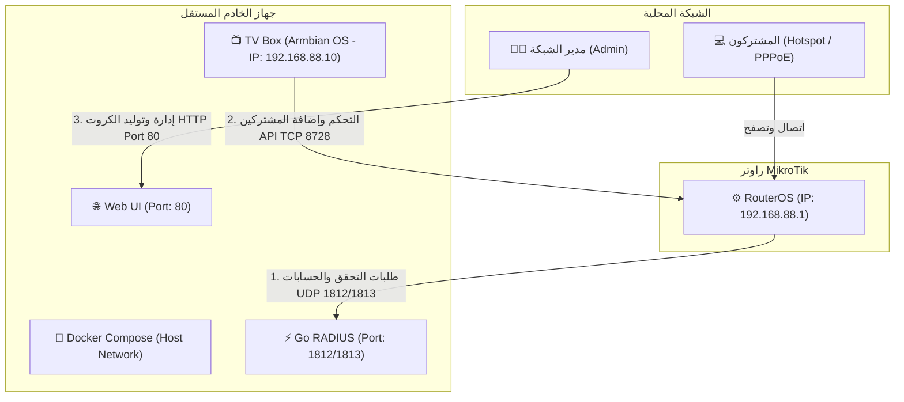

# دليل تحويل جهاز TV Box إلى خادم مستقل لنظام SASMAN (Armbian Appliance) 🚀

يرشدك هذا الدليل التفصيلي إلى كيفية تحويل أجهزة **Android TV Box** الرخيصة والمنتشرة محلياً إلى **خادم إدارة وشحن مخصص (Appliance)** فائق السرعة والاستقرار لنظام **SASMAN** باستخدام توزيعة **Armbian Linux**.

---

## 📐 مخطط هيكلية الشبكة (Network Topology)

يوضح المخطط التالي كيفية ربط الخادم الجديد بالمايكروتك والمشتركين لتبادل بيانات الـ RADIUS ولوحة الإدارة:



---

## 🧱 المرحلة الأولى: متطلبات العتاد والبرمجيات

### 1. الأجهزة الموصى بها (Hardware Selection)
*   **المعالج (CPU):** معالجات Amlogic عائلة **S905X, S905X3, S905W, S905X4** أو معالجات Rockchip عائلة **RK3318, RK3328**.
*   **الذاكرة (RAM):** يفضل **4GB** لتشغيل مريح جداً، وتعمل **2GB** بكفاءة استثنائية مع نظامنا نظراً لخفته الشديدة.
*   **كرت الشبكة (Ethernet):** يوصى بشدة باستخدام كرت شبكة سلكي مدمج، وفي حال رغبتك بأقصى درجات الثبات يرجى استخدام منفذ **USB-to-Ethernet Gigabit** (يعتمد على رقاقة **Realtek RTL8153**).
*   **بطاقة ذاكرة:** كرت MicroSD سعة 8 جيجابايت أو أعلى من فئة **Class 10 / A1** لتجنب بطء النظام أثناء التنصيب.

### 2. تحميل النظام (Armbian Image)
1. توجه إلى مستودع المطور **Ophub** الشهير والداعم لمعالجات الـ TV Box: [ophub/amlogic-s9xxx-armbian](https://github.com/ophub/amlogic-s9xxx-armbian).
2. من صفحة **Releases**، قم بتحميل صورة نظام خفيفة (بواجهة سطر أوامر فقط - CLI) مثل إصدار **Debian Bookworm** أو **Ubuntu Noble**.
3. قم بحرق الصورة على كرت الذاكرة باستخدام برنامج **balenaEtcher** أو **Rufus** على نظام ويندوز.

---

## 🔩 المرحلة الثانية: الإقلاع والتثبيت الأساسي

### 1. إعداد الـ DTB (Device Tree Blob)
الـ DTB هو الملف المسؤول عن تعريف العتاد (المعالج، المداخل، الواي فاي) لنظام Linux.
1. بعد حرق النظام، افتح كرت الذاكرة على جهاز الكمبيوتر.
2. ابحث عن ملف يسمى `u-boot.ext` و `extlinux.conf` (داخل مجلد `boot` أو المجلد الرئيسي).
3. افتح ملف `u-boot.ext` وتأكد من كتابة اسم ملف الـ DTB الخاص بمعالج جهازك بدقة (تجد قائمة كاملة بملفات الـ dtb داخل مجلد `dtb/amlogic/`).
   * *مثال لجهاز X96 Max+ (معالج S905X3):* الملف المناسب هو `meson-g12a-x96-max.dtb`.

### 2. الإقلاع الأول (First Boot)
1. أدخل كرت الذاكرة في الـ TV Box وهو مطفأ تماماً.
2. استخدم عود أسنان واضغط على زر الإعادة (Reset) المخفي داخل منفذ الـ AV (مخرج الصوت التناظري) واستمر بالضغط.
3. قم بتوصيل كابل الطاقة مع الاستمرار بالضغط على الزر لمدة 5 إلى 10 ثوانٍ حتى يظهر شعار Armbian على الشاشة أو يبدأ كرت الذاكرة بالوميض.
4. ابحث عن الآيبي الذي حصل عليه الجهاز من خلال راوتر المايكروتك (أو أي سيرفر DHCP في الشبكة).

### 3. الاتصال وتهيئة حساب الـ Root
1. اتصل بالجهاز عبر SSH (باستخدام برنامج **PuTTY** أو Terminal):
   ```bash
   ssh root@<TV_BOX_IP>
   ```
   *كلمة المرور الافتراضية:* `1234`
2. سيطلب منك النظام مباشرة تعيين كلمة مرور جديدة للـ root، وتحديد محث النظام الافتراضي (Bash)، وإنشاء مستخدم عادي إضافي.

### 4. التثبيت على الذاكرة الداخلية eMMC (خطوة اختيارية وموصى بها بشدة)
لتسريع استجابة النظام بمعدل **5 أضعاف** والاستغناء تماماً عن كرت الذاكرة:
1. نفذ الأمر التالي في الطرفية:
   ```bash
   sudo armbian-install
   ```
2. اختر نوع الجهاز ورقم المعالج من القائمة التفاعلية، ثم اختر نظام الملفات (`ext4`).
3. بعد اكتمال التثبيت، قم بإيقاف تشغيل الجهاز ونزع كرت الذاكرة، ثم أعد التشغيل ليعمل النظام مباشرة من الذاكرة الداخلية السريعة للـ TV Box.

---

## 💻 المرحلة الثالثة: إعداد خادم SASMAN وتثبيت Docker

### 1. تثبيت Docker و Docker Compose بضغطة زر
نفذ الأمر الموحد التالي لتثبيت المحرك الأساسي للحاويات:
```bash
curl -fsSL https://get.docker.com -o get-docker.sh && sh get-docker.sh
```

### 2. إعداد مجلدات النظام وهجرة البيانات (Migration)
إذا كان لديك نظام SASMAN يعمل سابقاً داخل المايكروتك وتريد نقل قاعدة بيانات المشتركين والإعدادات والترخيص دون فقدان أي بيانات:
1. أنشئ مجلد المشروع في الـ TV Box:
   ```bash
   mkdir -p /opt/sasman && mkdir -p /opt/sasman/data
   ```
2. انقل ملفات قاعدة البيانات الخاصة بك (مثل `sasman_migrated.db` أو `config.json` أو ملفات LMDB) من الراوتر أو جهازك الحالي إلى المجلد الجديد في الـ TV Box داخل المسار: `/opt/sasman/data/`.

### 3. كتابة ملف التشغيل `docker-compose.yml`
أنشئ ملف الإعداد داخل مجلد `/opt/sasman/`:
```bash
nano /opt/sasman/docker-compose.yml
```
وقم بنسخ الكود التالي بداخله:
```yaml
version: '3.8'

services:
  sasman-app:
    image: ahmedkin99/sasman-manager:latest
    container_name: sasman-server
    restart: always
    network_mode: host # مهم جداً للـ RADIUS لتخطي مشاكل NAT وتوفير سرعة استجابة فورية
    volumes:
      - ./data:/app/data
    environment:
      - PORT=80
      - GODEBUG=x509negativeserial=1
      - CLOUDFLARE_TUNNEL_ENABLED=true
    logging:
      driver: "json-file"
      options:
        max-size: "10m"
        max-file: "3"
```
اضغط `Ctrl+O` ثم `Enter` للحفظ، و `Ctrl+X` للخروج.

### 4. تشغيل النظام لأول مرة
من داخل مجلد `/opt/sasman/` نفذ الأمر التالي:
```bash
docker compose up -d
```
سيقوم النظام بسحب النسخة المتوافقة تلقائياً مع معمارية الـ ARM64 الخاصة بالـ TV Box وتشغيلها فوراً كخدمة خلفية مستمرة.

---

## ⚙️ المرحلة الرابعة: ربط المايكروتك بالخادم الجديد (MikroTik Configuration)

الآن سنقوم بتوجيه طلبات الـ RADIUS من المايكروتك إلى خادم الـ TV Box الجديد بدلاً من الحاوية الداخلية للراوتر.

1. افتح **New Terminal** في الـ Winbox ونفذ الأوامر التالية (بافتراض أن آيبي الـ TV Box هو `192.168.88.10`):

```routeros
# 1. إعداد خادم الـ RADIUS للتحقق والحسابات (مع إعطاء الأولوية للسرعة)
/radius add address=192.168.88.10 secret="your_shared_secret" service=hotspot,ppp timeout=3000ms

# 2. إتاحة قبول طلبات الفصل الواردة من السيرفر (Incoming RADIUS CoA)
/radius incoming set accept=yes port=3799

# 3. توجيه بروفايل الهوتسبوت لاستخدام الـ RADIUS الجديد
/ip hotspot profile set [find name="default"] use-radius=yes
```

> [!NOTE]
> تأكد من مطابقة كلمة السر المشتركة (`secret`) في المايكروتك مع الإعدادات الموجودة في واجهة إدارة SASMAN لتجنب أخطاء رفض الاتصال (Access-Reject).

---

## 💎 تحسينات الأداء الفائقة واستقرار النظام (Production Tweaks)

بما أن الجهاز سيعمل كخادم يعمل بشكل متواصل 24/7، فمن الضروري تطبيق هذه التعديلات المتقدمة للحفاظ على استقرار العتاد وحمايته:

### 1. إيقاف الواجهة الرسومية (Save 500MB+ RAM)
أجهزة الـ TV Box لا تحتاج لعرض واجهة رسومية على الشاشة في حال تشغيلها كخادم شبكة. لتعطيلها وتوفير الذاكرة للمعالجة:
```bash
sudo systemctl set-default multi-user.target
```
*لإعادتها لاحقاً إذا رغبت:* `sudo systemctl set-default graphical.target`

### 2. ضبط المعالج للأداء الأقصى (CPU Governor Tuning)
بشكل افتراضي، تقوم أنظمة الاندرويد والـ TV Box بخفض تردد المعالج لتوفير الطاقة. لجعله يعمل بكفاءة قصوى للرد الفوري على طلبات الـ RADIUS:
```bash
# تثبيت حزمة إدارة التردد
sudo apt-get install -y cpufrequtils

# ضبط الحاكم على وضع الأداء الأقصى
echo 'GOVERNOR="performance"' | sudo tee /etc/default/cpufrequtils
sudo systemctl restart cpufrequtils
```

### 3. حماية الفلاش الداخلي والذاكرة من التلف (Prevent SD/eMMC Burnout)
تقوم الحاويات وأنظمة Linux بكتابة الكثير من السجلات (Logs) بشكل مستمر، مما يؤدي لتلف الـ Flash Memory بعد فترة.
لتفادي ذلك، نقوم بتوجيه المجلدات المؤقتة والسجلات لتعمل داخل الذاكرة العشوائية (RAM) بدلاً من القرص عبر تقنية `tmpfs`:

1. افتح ملف إعدادات الأقراص:
   ```bash
   sudo nano /etc/fstab
   ```
2. أضف الأسطر التالية في نهاية الملف:
   ```text
   tmpfs   /var/log    tmpfs   defaults,noatime,nosuid,mode=0755,size=50m    0   0
   tmpfs   /tmp        tmpfs   defaults,noatime,nosuid,nodev,size=100m       0   0
   ```
3. احفظ الملف وأعد تشغيل الجهاز. الآن سيتم مسح السجلات المؤقتة غير الهامة تلقائياً عند إعادة التشغيل وتوفير عمر افتراضي طويل جداً للذاكرة الداخلية.

---

## 💾 المرحلة الخامسة: إنشاء نسخة حرق كاملة وجاهزة للتوزيع (Ready-to-Flash Image)

للحصول على "نسخة كاملة جاهزة للحرق مباشرة" دون الحاجة لتكرار خطوات التنصيب والإعداد على كل جهاز TV Box جديد، يمكنك أخذ نسخة احتياطية كاملة (Backup Clone) من جهازك الأول (Master) بعد ضبطه بالكامل، أو **توليدها تلقائياً مباشرة من جهازك الكمبيوتر بضغطة زر واحدة (الطريقة الأسهل)!**

---

### 1. الطريقة الأولى والأقوى: التوليد التلقائي بضغطة زر من كمبيوترك (WSL / Docker Seeding)
لقد قمت بإعداد نظام أتمتة كامل لك داخل مجلد المشروع! يمكنك دمج ملف النظام Armbian وحقن نظام SASMAN والتحسينات التشغيلية مباشرة داخل الصورة باستخدام Docker على ويندوز (الذي يستغل WSL 2 خلف الكواليس):

#### 📋 المتطلبات والخطوات:
1. تأكد من أن برنامج **Docker Desktop** يعمل على جهاز الكمبيوتر الخاص بك.
2. قم بتحميل صورة نظام **Armbian** الافتراضية المناسبة لمعالج جهازك (بامتداد `.img` فقط، فك الضغط عنها إذا كانت مضغوطة) وضعها في المجلد الرئيسي لمشروعك (بجانب ملفات المشروع الحالية).
3. (اختياري) تأكد من وجود ملف الحاوية المسبقة الرفع `sasman-manager-arm.tar` في المجلد لتضمينها داخل الصورة لتعمل بشكل كامل **بدون إنترنت (Offline)**.
4. قم بالنقر المزدوج على ملف **`build_appliance_image.bat`** الذي أنشأته لك في المجلد الرئيسي.
5. سيقوم السكربت ببدء حاوية Ubuntu بصلاحيات كاملة، والقيام بالآتي:
   * ربط صورة النظام Armbian كقرص وهمي (`loop device`).
   * تركيب وقراءة مساحة النظام وحقن ملف تشغيل الـ **`docker-compose.yml`** تلقائياً.
   * إعداد خدمة إقلاع ذاتية للتشغيل الأول تقوم بتثبيت Docker وتجهيز حاويات SASMAN للعمل تلقائياً فور التشغيل.
   * **حقن تحسينات الأداء مباشرة:** تعطيل الواجهة الرسومية، ضبط تردد المعالج الأقصى، وتفعيل الـ `tmpfs` لحفظ عمر الذاكرة.
   * فك القرص الوهمي وتصدير ملف صورة نهائي جاهز للحرق باسم: **`sasman-appliance.img`**.
6. **الآن ما عليك سوى فتح Rufus وحرق ملف `sasman-appliance.img` الناتج مباشرة على كرت الذاكرة!**

---

### 2. الطريقة الثانية: باستخدام أداة `ddbr` المدمجة (للأجهزة بمعالج Amlogic)
تأتي توزيعة Armbian المخصصة لأجهزة الـ TV Box مزودة بأداة نسخ احتياطي فائقة السهولة تسمى `ddbr` تقوم بأخذ نسخة طبق الأصل من الذاكرة الداخلية للـ eMMC وحفظها على فلاشة USB خارجية:

1. قم بتوصيل فلاشة USB خارجية (مفرطة ومفرغة بالكامل، بسعة أكبر من الذاكرة الداخلية للـ TV Box) في منفذ الـ USB بالجهاز.
2. اتصل بالجهاز عبر SSH واكتب الأمر التالي:
   ```bash
   sudo ddbr
   ```
3. ستظهر لك قائمة تسألك عن الإجراء المطلوب:
   * اكتب `b` (المقصود بها **Backup**).
   * اضغط `Enter` ثم قم بتأكيد كتابة الملف على فلاشة الـ USB الخارجية.
4. ستقوم الأداة بضغط كامل محتويات الذاكرة الداخلية (بما فيها نظام التشغيل، الـ Docker، حاوية SASMAN، والبيانات) في ملف واحد مضغوط بامتداد `.img.gz` (على سبيل المثال: `ddbr-[date].img.gz`).
5. **الآن لديك صورة النظام الكاملة!** لنشرها على جهاز TV Box جديد من نفس الموديل:
   * أدخل الفلاشة وبطاقة الـ SD بالـ TV Box الجديد، ثم أدخل في وضع الـ SSH واكتب `ddbr`.
   * اختر `r` (المقصود بها **Restore**)، وسيتم نسخ النظام بالكامل ومباشرة على الذاكرة الداخلية للجهاز الجديد خلال دقائق معدودة!

---

### 2. الطريقة الثانية: تصوير كرت الذاكرة بالكامل من الكمبيوتر (SD Card Cloning)
إذا كنت تقوم بتشغيل النظام مباشرة من كرت الذاكرة (MicroSD) وتريد أخذ نسخة مطابقة له لحرقها مباشرة على كروت ذاكرة جديدة لأجهزة أخرى:

#### أ. أخذ النسخة (Backup):
1. قم بإيقاف تشغيل الـ TV Box ونزع كرت الذاكرة.
2. أدخل كرت الذاكرة في جهاز الكمبيوتر (الذي يعمل بنظام ويندوز).
3. افتح برنامج **Win32 Disk Imager** (برنامج مجاني شهير).
4. في خانة **Image File**: اختر مسار حفظ الملف واكتب اسماً له (مثلاً `sasman-appliance-master.img`).
5. في خانة **Device**: اختر الرمز الخاص بكرت الذاكرة الخاص بك.
6. اضغط على زر **Read** (وليس Write!). سيبدأ البرنامج بنسخ كرت الذاكرة بالكامل قطاعاً بقطاع وحفظه كملف `.img` على جهاز الكمبيوتر الخاص بك.

> [!TIP]
> **نصيحة ذهبية لتصغير حجم الملف (Image Shrinking):**
> نظراً لأن حجم ملف الـ `.img` الناتج سيكون مساوياً لحجم كرت الذاكرة بالكامل (مثلاً 16GB أو 32GB)، يوصى بشدة بتشغيل أداة مجانية تسمى **PiShrink** (على نظام لينكس) لضغط حجم الملف وإزالة المساحات الفارغة تلقائياً ليصبح حجم الصورة المحروقة 2GB فقط، وتتمدد تلقائياً عند أول إقلاع على أي كرت ذاكرة جديد مهما كان حجمه!
> ```bash
> wget https://raw.githubusercontent.com/Drewsif/PiShrink/master/pishrink.sh
> chmod +x pishrink.sh
> sudo ./pishrink.sh sasman-appliance-master.img
> ```

#### ب. الحرق الجماعي (Restore / Flashing):
الآن أصبح لديك ملف `sasman-appliance-master.img` الجاهز. لنشره على أجهزة جديدة:
1. افتح برنامج **Rufus** أو **balenaEtcher** على الكمبيوتر.
2. اختر ملف الـ `.img` الذي قمت بإنشائه.
3. اختر كرت الذاكرة الجديد واضغط **Write/Flash**.
4. بمجرد انتهاء الحرق، ضع كرت الذاكرة في الـ TV Box الجديد وشغله، وستجد السيرفر يعمل مباشرة ومستعداً للخدمة فوراً دون أي إعدادات إضافية!

---

## 🔍 فحص وتشخيص المشاكل (Troubleshooting)

### 1. التحقق من عمل المنافذ على الـ TV Box
تأكد من أن نظام SASMAN يستمع بشكل صحيح للمنافذ المطلوبة:
```bash
ss -tulpn | grep -E '80|1812|1813'
```
*يجب أن تظهر النتيجة استماع الحاوية على بورت الويب 80 وبورتات الـ RADIUS 1812/1813 UDP.*

### 2. التحقق من السجلات الفورية للحاوية
لمراقبة عمليات تسجيل الدخول للمشتركين أو أي مشاكل في الاتصال بالمايكروتك:
```bash
docker logs -f sasman-server
```

### 3. إرسال حزمة اختبارية للـ RADIUS محلياً
لاختبار ما إذا كان محرك الـ RADIUS يستجيب للطلبات بشكل سليم:
1. قم بتثبيت حزمة فحص الـ RADIUS:
   ```bash
   sudo apt-get install -y freeradius-utils
   ```
2. نفذ أمر الفحص (استبدل القيم بما يطابق الإعدادات لديك):
   ```bash
   radtest test_user test_password localhost 1812 testing123
   ```
   *إذا تلقيت رد `Access-Accept` فإن خادمك يعمل بنسبة 100% وجاهز لاستقبال المستخدمين!*

