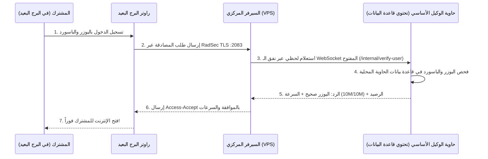

# دليل إدارة أجهزة الراوتر (NAS) وبروتوكولات الاتصال (UDP & RadSec TLS)

يقدم هذا الدليل شرحاً شاملاً وتفصيلياً لكافة عناصر واجهة إدارة أجهزة الـ **NAS (Network Access Server)** في نظام **SASMAN**، وكيفية إعداد وربط راوترات **MikroTik** سواء عبر بروتوكول **UDP التقليدي السريع** أو عبر بروتوكول **RadSec (TLS / mTLS)** المشفر والمخصص للفروع البعيدة التي تعمل خلف **CGNAT**، مع شرح معماري لكيفية عزل وتوجيه طلبات المصادقة بين مختلف الوكلاء.

---

## 📑 فهرس المحتويات
1. [المفهوم المعماري ومحرك الـ Dual-Stack](#1-المفهوم-المعماري-ومحرك-الـ-dual-stack)
2. [شرح عناصر وحقول واجهة الـ NAS](#2-شرح-عناصر-وحقول-واجهة-الـ-nas)
3. [دليل إعداد الاتصال المحلي (UDP Mode)](#3-دليل-إعداد-الاتصال-المحلي-udp-mode)
4. [دليل إعداد الاتصال المشفر والبعيد (RadSec / TLS Mode)](#4-دليل-إعداد-الاتصال-المشفر-والبعيد-radsec--tls-mode)
5. [كيف تتم المصادقة وتمييز الوكلاء عن بعضهم (Multi-Agent Routing & Privacy)](#5-كيف-تتم-المصادقة-وتمييز-الوكلاء-عن-بعضهم-multi-agent-routing--privacy)
6. [آلية التحكم والقطع العكسي خلف CGNAT (Reverse Disconnect)](#6-آلية-التحكم-والقطع-العكسي-خلف-cgnat-reverse-disconnect)
7. [جدول المقارنة بين UDP و RadSec TLS](#7-جدول-المقارنة-بين-udp-و-radsec-tls)
8. [استكشاف الأخطاء والتشخيص (Troubleshooting)](#8-استكشاف-الأخطاء-والتشخيص-troubleshooting)

---

## 1. المفهوم المعماري ومحرك الـ Dual-Stack

يعمل خادم الـ RADIUS في **SASMAN** بنظام **المحرك المزدوج (Dual-Stack Engine)**:
* **منافذ الـ UDP (1812 للمصادقة و 1813 للمحاسبة):** مخصصة للاتصالات المحلية السريعة داخل نفس البرج أو نفس الشبكة المحلية أو الحاوية المباشرة.
* **منفذ الـ RadSec TLS (2083 TCP):** مخصص للاتصالات المشفرة وفق معيار **RFC 6614** مع التحقق المتبادل من الشهادات (**mTLS**)، وهو الحل للربط مع الفروع البعيدة والراوترات التي لا تمتلك Real IP وتعمل خلف مزودي خدمة يطبقون **CGNAT**.

> **ملاحظة:** كلا البروتوكولين يتصلان بنفس قاعدة البيانات وبنفس المستخدمين والحسابات بالتوازي دون أي تعارض.

---

## 2. شرح عناصر وحقول واجهة الـ NAS

عند الدخول إلى لوحة تحكم SASMAN ⬅️ تبويب **الراوترات (NAS)**، ستجد الجدول التالي:

### أ. أعمدة جدول الراوترات:
| العمود | الوصف |
| :--- | :--- |
| **IP العميل** | عنوان الـ IP الذي يُرسل منه راوتر المايكروتك طلبات الـ RADIUS (مثلاً: `172.17.0.1` أو `192.168.88.1`). |
| **NAS-IP للباقات** | عنوان الـ IP التعريفي للراوتر بالمايكروتك؛ يُستخدم لحصر باقات أو بروفايلات معينة براوتر محدد. إذا تُرك فارغاً تكون الباقات متاحة للجميع. |
| **الاسم** | الاسم التعريفي للراوتر أو البرج لتمييزه بسهولة (مثال: `Tower-North` أو `Branch-Baghdad`). |
| **الكلمة السرية** | السر المشترك (Shared Secret) المتطابق بين المايكروتك وسيرفر الراديوس للـ UDP (مثلاً: `123456`). |
| **بروتوكول الاتصال (RadSec)** | شارة الحالة التفاعلية: <br> • 🟢 **`متصل RadSec`**: الراوتر متصل حالياً عبر جلسة TLS مشفرة ونشطة وموثقة بالشهادات الرقمية. <br> • ⚪ **`شهادة صادرة`**: تم إصدار شهادة رقمية للراوتر وجاهزة للاستخدام في المايكروتك. <br> • 🔵 **`UDP مباشر`**: الراوتر يعمل بنمط الـ UDP المباشر القياسي. |
| **المالك** | يحدد اسم الوكيل/الموزع المالك لهذا الراوتر (متاح لمدير النظام Superadmin). |
| **الإجراءات** | أزرار التحكم بالراوتر. |

---

### ب. أزرار التحكم والإجراءات:

1. 📖 **`دليل التوثيق والإعداد (UDP / RadSec)`**:
   - فتح دليل توثيقي تفاعلي كامل داخل شاشة النظام لشرح الخطوات والأوامر مع ميزة النسخ المباشر.
2. ⚡ **`إعداد راديوس سريع (نظام ومايكروتك)`**:
   - زر الإعداد السحري لراوتر المايكروتك المحلي المرتبط بنفس الحاوية أو السيرفر؛ يقوم بإضافة الراوتر بـ IP `172.17.0.1` وسر `123456` وبرمجة المايكروتك تلقائياً للـ Hotspot والـ PPPoE والـ Wireless بضغطة زر واحدة.
3. ➕ **`ربط راوتر جديد (NAS)`**:
   - لربط راوتر إضافي أو فرع جديد وتحديد بيانات الـ IP والسر والمالك.
4. ✏️ **`تعديل`**: لتعديل بيانات الراوتر أو الاسم أو كلمة السر المشتركة.
5. 🗑️ **`حذف`**: لحذف الراوتر من السيرفر.
6. 🔑 **`شهادة (Generate Certificate)`**:
   - يقوم بتوليد شهادة رقمية ومفتاح مشفر خاص بهذا الراوتر موقعين من الـ Root CA الداخلي للنظام بصلاحية 3 سنوات.
7. 📥 **`الحزمة (Download Bundle)`**:
   - تحميل ملف مضغوط `.zip` يحتوي على شهادات الاتصال الكاملة وملف التكوين:
     * `ca.crt`: الشهادة الجذرية لخادم SASMAN.
     * `agent.crt`: شهادة الراوتر المشفرة.
     * `agent.key`: المفتاح الخاص للشهادة.
     * `agent-config.json`: ملف الإعداد التلقائي.
8. 🚫 **`إبطال (Revoke)`**:
   - إلغاء وإبطال شهادة الراوتر وفصل اتصاله بالـ TLS فوراً لأسباب أمنية.

---

## 3. دليل إعداد الاتصال المحلي (UDP Mode)

يُستخدم هذا النمط عندما يكون راوتر المايكروتك والحاوية/السيرفر في **نفس البرج أو نفس الشبكة المحلية (LAN)**.

### الخطوات:
1. من لوحة تحكم SASMAN، اضغط على **"➕ ربط راوتر جديد"** وضع:
   - **IP العميل:** عنوان الـ IP المحلي للمايكروتك (مثلاً: `172.17.0.1` أو `192.168.88.1`).
   - **الاسم:** اسم البرج.
   - **الكلمة السرية:** كلمة السر (مثلاً: `123456`).
2. افتح **Terminal** في راوتر المايكروتك ونفذ الأوامر التالية (مع وضع IP سيرفر SASMAN وكلمة السر):

```routeros
# إضافة خادم RADIUS بنمط UDP
/radius add address=172.17.0.1 secret=123456 service=hotspot,ppp,wireless authentication-port=1812 accounting-port=1813 timeout=3000ms

# تفعيل استقبال طلبات طرد المستخدمين (CoA / Disconnect)
/radius incoming set accept=yes port=3799
```

---

## 4. دليل إعداد الاتصال المشفر والبعيد (RadSec / TLS Mode)

يُستخدم هذا النمط عند ربط **فروع بعيدة عبر الإنترنت العام** أو راوترات تعمل خلف **CGNAT** بدون Real IP.

### الخطوات التفصيلية:

#### الخطوة 1: إصدار الشهادات من لوحة التحكم
1. ادخل إلى لوحة التحكم ⬅️ **الراوترات (NAS)**.
2. اضغط زر **"🔑 شهادة"** أمام الراوتر المطلوب.
3. اضغط زر **"📥 الحزمة"** لتحميل ملف الـ `.zip`.
4. فك الضغط عن الملف للحصول على (`ca.crt`, `agent.crt`, `agent.key`).

#### الخطوة 2: فتح المنفذ في السيرفر المركزي (VPS / Server)
تأكد من فتح المنفذ في الجدار الناري للسيرفر:
```bash
sudo ufw allow 2083/tcp
```

#### الخطوة 3: استيراد الشهادات في MikroTik RouterOS 7
1. اسحب الملفات الثلاثة (`ca.crt`, `agent.crt`, `agent.key`) وضعها في قائمة **Files** في Winbox.
2. افتح الـ **Terminal** ونفذ أوامر الاستيراد:
```routeros
/certificate import file-name=ca.crt passphrase=""
/certificate import file-name=agent.crt passphrase=""
/certificate import file-name=agent.key passphrase=""
```

#### الخطوة 4: تفعيل RadSec في المايكروتك
نفذ الأمر التالي (استبدل `YOUR_SERVER_IP` بعنوان الـ IP العام أو الدومين لسيرفرك المركزي):
```routeros
/radius add address=YOUR_SERVER_IP protocol=radsec certificate=agent.crt service=hotspot,ppp,wireless secret=radsec timeout=3000ms authentication-port=2083 accounting-port=2083
```

#### الخطوة 5: تفعيل استقبال طلبات القطع (Incoming)
```routeros
/radius incoming set accept=yes port=3799
```

---

## 5. كيف تتم المصادقة وتمييز الوكلاء عن بعضهم (Multi-Agent Routing & Privacy)

### كيف تتم المصادقة وبيانات المشتركين موجودة في حاوية الوكيل المحلي؟
في نظام **SASMAN**، تحتفظ كل حاوية وكيل بقاعدة بيانات مشتركيها محلياً لضمان الخصوصية والسرعة. عندما يتصل راوتر برج بعيد بالسيرفر المركزي، يقوم النظام بتمرير الطلب والتأكد من المشترك عبر نفق الـ WebSocket المشفر:



---

### كيف يميز السيرفر أن المشترك يتبع الوكيل A وليس الوكيل B؟

يستخدم النظام **3 آليات دقيقة** لمنع أي تداخل بين الوكلاء:

#### 1. عبر شهادة الراوتر المشفرة (RadSec CommonName & NAS Mapping):
* كل راوتر يتم إصدار شهادة خاصة به تحمل في الـ `CommonName (CN)` معرّف الوكيل والراوتر (مثلاً: `agent-1-TowerNorth`).
* عندما يتصل الراوتر بالسيرفر، يعرف السيرفر فوراً أن هذا البرج ملك **الوكيل A**.
* يتم تحويل أي طلب مصادقة قادم من هذا البرج تلقائياً وبشكل حصري إلى **حاوية الوكيل A**.

#### 2. عبر نطاق اسم المستخدم في التجوال المشترك (User Realm / Roaming):
* إذا كان المشترك مسجلاً لدى **الوكيل A** ولكنه اتصل من برج يتبع **الوكيل B**:
* يكتب المشترك حسابه بصيغة: `user@agent_a` أو `agent_a\user`.
* يقوم السيرفر المركزي بفصل اسم الوكيل وتوجيه طلب التحقق مباشرة لحاوية الوكيل A، ويتم فتح النت للمشترك عبر برج الوكيل B مع حفظ رصيده وسرعته!

#### 3. عبر الكروت الموحدة المركزية (Global Roaming Vouchers):
* الكروت الصادرة مركزياً من السيرفر العام (PIN Vouchers) يتم التحقق منها مباشرة في قاعدة البيانات المركزية.

---

## 6. آلية التحكم والقطع العكسي خلف CGNAT (Reverse Disconnect)

### المشكلة في الشبكات التقليدية:
في أنظمة الراديوس القديمة، عندما ينتهي اشتراك يوزر أو تضغط على زر "طرد"، يقوم السيرفر بإرسال طلب `Disconnect-Request UDP` إلى عنوان IP الراوتر على منفذ `3799`. ولكن إذا كان الراوتر البعيد خلف **CGNAT** (عنوان IP خاص غير حقيقي مثل `10.x.x.x` أو `100.64.x.x`)، فإن حزمة القطع تفشل وتضيع لعدم إمكانية الوصول للراوتر من الخارج.

### حل SASMAN المبتكر:
1. عند اتصال راوتر المايكروتك البعيد بنمط **RadSec mTLS**، يحتفظ السيرفر بقناة الـ TCP/TLS المفتوحة في الذاكرة الحية (`AgentConnectionRegistry`).
2. عند انتهاء رصيد المشترك أو طلب فصله، يقوم السيرفر بضخ حزمة `Disconnect-Request` **عكسياً داخل نفس قناة الـ TLS المفتوحة**.
3. يستقبل المايكروتك الحزمة ويفصل المشترك فوراً ويرسل الـ `Disconnect-ACK` التأكيدي للسيرفر.
4. **النتيجة:** طرد وفصل فوري لليوزرات المنتهية بدون Real IP وبدون أي فتح للمنافذ في الفرع البعيد!

---

## 7. جدول المقارنة بين UDP و RadSec TLS

| وجه المقارنة | نمط الـ UDP المحلي | نمط الـ RadSec TLS المشفر |
| :--- | :---: | :---: |
| **المنفذ المستخدم** | `UDP 1812` (Auth) و `UDP 1813` (Acct) | `TCP 2083` (Auth + Acct + CoA) |
| **التشفير** | غير مشفر (مناسب للشبكات الداخلية) | مشفر بالكامل (TLS 1.3/1.2 مع mTLS) |
| **الشهادات الرقمية** | لا يحتاج شهادات | يحتاج شهادات موثقة من Internal CA |
| **العمل خلف CGNAT** | يحتاج اتصال شبكي مباشر | **يعمل 100% خلف أي CGNAT أو نات مزود** |
| **طرد المشتركين (CoA)** | عبر إرسال UDP 3799 مباشر | **عبر القناة العكسية المفتوحة (Reverse CoA)** |
| **الاستخدام المثالي** | الراوتر المحلي، الكابينة، البرج المباشر | الفروع البعيدة، المحافظات، الأبراج الخارجية |

---

## 8. استكشاف الأخطاء والتشخيص (Troubleshooting)

### 1. الراوتر لا يظهر كـ `متصل RadSec 🟢` في لوحة التحكم:
* تأكد من أن منفذ `2083 TCP` مفتوح في سيرفر الـ VPS (`sudo ufw status`).
* تأكد من استيراد الشهادات الثلاثة بنجاح في المايكروتك في `/certificate print`.
* تأكد من كتابة `secret=radsec` و `protocol=radsec` في أمر المايكروتك.

### 2. رسالة `unknown CA` أو `certificate expired`:
* تأكد من ضبط وقت وتاريخ وساعة المايكروتك بشكل صحيح عبر الـ SNTP Client (`/system clock print`).

### 3. فحص سجلات الراديوس والـ RadSec الحية:
يمكنك متابعة سجلات الاتصال والرسائل في الخادم عبر الأمر:
```bash
tail -f data/radius.log
```
أو من خلال تبويب **سجلات الراديوس (Radius Logs)** داخل لوحة التحكم.
