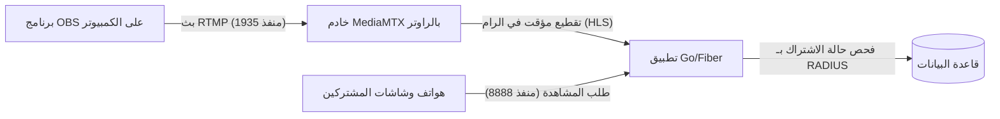

# 📡 دليل إعداد وتشغيل نظام البث المباشر المحلي (SASMAN Local Streaming)

مرحباً بك في دليل التشغيل المتكامل لنظام البث المباشر المحلي المدمج مع **SASMAN RADIUS**. تم إعداد هذا الدليل لمساعدتك خطوة بخطوة في إعداد القنوات داخل لوحة التحكم، وضبط برنامج **OBS Studio** بأفضل الإعدادات لضمان بث سريع، خفيف، وبأقل زمن تأخير ممكن (Low Latency).

---

## 🏗️ فكرة عمل النظام والتدفق التقني

يعمل النظام محلياً بالكامل داخل حاوية Docker واحدة على جهاز MikroTik دون الحاجة للاتصال بالإنترنت:



---

## 💻 أولاً: إعداد القنوات في لوحة تحكم مدير النظام (SASMAN Admin)

لتجهيز النظام لاستقبال البث، يجب أولاً إنشاء القناة في لوحة التحكم الإدارية لـ SASMAN:

1. افتح متصفح الويب واذهب إلى لوحة تحكم SASMAN الإدارية (عبر المنفذ `80`).
2. اضغط على تبويب **📡 البث المباشر** الجديد في شريط التنقل.
3. اضغط على زر **➕ إضافة قناة جديدة**.
4. املأ الحقول في النافذة المنبثقة كالتالي:
   * **معرف القناة (ID):** اكتب معرف فريد باللغة الإنجليزية بدون مسافات أو رموز خاصة (مثال: `sport1` أو `kids_tv`). **(هذا المعرف مهم جداً وسنستخدمه كمفتاح للبث في OBS)**.
   * **اسم القناة:** الاسم الذي سيظهر للمشتركين في واجهتهم (مثال: `MBC Sports HD`).
   * **نوع المصدر (Source):** اترك القيمة الافتراضية كما هي: `publisher`.
   * **الحالة:** اختر `نشط` لتظهر للمشتركين فوراً، أو `معطل` لإخفائها مؤقتاً.
5. اضغط على **حفظ القناة**.

> [!NOTE]
> بمجرد حفظ القناة، ستظهر في جدول القنوات. ستجد هناك روابط النشر (RTMP) وروابط المشاهدة (HLS) الخاصة بها لتسهيل إدارتها.

---

## 📹 ثانياً: إعداد البث في برنامج OBS Studio

افتح برنامج **OBS Studio** على الكمبيوتر المتصل بالشبكة المحلية واتبع الخطوات التالية لتوجيه البث للراوتر:

### 1. إعدادات خادم البث (Stream Settings)
* اذهب إلى **Settings** (الإعدادات) في برنامج OBS.
* اختر تبويب **Stream** (البث) من القائمة الجانبية.
* في خانة **Service** (الخدمة)، اختر **`Custom...`** (مخصص).
* في خانة **Server** (الخادم)، ضع عنوان خادم RTMP الخاص بالراوتر كالتالي (استبدل `ROUTER_IP` بـ IP الراوتر أو الحاوية):
  ```text
  rtmp://ROUTER_IP:1935/
  ```
  *مثال: `rtmp://192.168.88.250:1935/`*
* في خانة **Stream Key** (مفتاح البث)، اكتب **معرف القناة (ID)** الذي قمت بإنشائه في لوحة التحكم الإدارية بالضبط:
  ```text
  sport1
  ```

---

### 2. ضبط جودة البث والترميز لضمان الاستقرار (Output Settings) ⚠️
بما أن البث سيعمل على راوتر MikroTik ذو موارد محدودة وسيشاهد المشتركون البث عبر شبكة Wi-Fi محلية، **يجب** ضبط إعدادات الترميز في OBS بدقة متناهية لمنع التقطيع وحماية الراوتر من البطء:

* في قائمة الإعدادات، اذهب إلى تبويب **Output** (المخرجات).
* قم بتغيير **Output Mode** (وضع المخرجات) في الأعلى من *Simple* إلى **`Advanced`** (متقدم).
* في تبويب **Streaming**، اضبط القيم التالية بدقة:

| الحقل في OBS | القيمة الموصى بها | السبب التقني |
| :--- | :--- | :--- |
| **Encoder** (المشفر) | **NVIDIA NVENC H.264** أو **QuickSync** | استخدام كرت الشاشة الخارجي للكمبيوتر بدلاً من المعالج لضمان سلاسة البث. (إذا لم يتوفر، اختر `x264`). |
| **Rate Control** | **CBR** | معدل بث ثابت لمنع حدوث قفزات مفاجئة في استهلاك شبكة الـ Wi-Fi. |
| **Bitrate** (معدل البث) | **1500 Kbps** إلى **2500 Kbps** | يعطي جودة صورة ممتازة جداً (720p/1080p) ومستقر تماماً في الإرسال والاستقبال المحلي. |
| **Keyframe Interval** | **`2 s`** (ثانيتين) | **هام جداً!** خادم البث يقوم بتقطيع الفيديو إلى أجزاء طول كل منها ثانيتان. عدم ضبط هذا الخيار على 2 سيتسبب في توقف البث وتجمده في هواتف المشتركين! |
| **CPU Usage Preset** | **superfast** أو **veryfast** | لتقليل الضغط على معالج الكمبيوتر أثناء البث. |
| **Profile** | **baseline** أو **main** | لضمان أن البث سيعمل على كافة الهواتف والشاشات القديمة والحديثة دون مشاكل توافقية. |
| **Tune** | **`zerolatency`** | لتقليل زمن التأخير بين ما تبثه وما يراه المشترك إلى أقل من ثانية واحدة! |

* اضغط على **Apply** ثم **OK** لحفظ الإعدادات.

---

## 🚀 ثالثاً: تشغيل البث والمشاهدة

1. بعد الانتهاء من إعداد OBS وإضافة مشاهدك (الكاميرا أو شاشة العرض أو مقاطع الفيديو)، اضغط على **Start Streaming** (بدء البث).
2. سيتحول المربع الصغير في أسفل واجهة OBS إلى اللون الأخضر وسيظهر معدل الرفع بالـ Kbps.
3. الآن، اطلب من أي مشترك تسجيل الدخول إلى حسابه في بوابة المشتركين **Portal**.
4. سيجد المشترك قسماً جديداً كلياً باسم **📡 البث المحلي المباشر** ويحتوي على قائمة بالقنوات النشطة وبجانبها مؤشر نبض أحمر يكتب `مباشر الآن`.
5. بمجرد ضغط المشترك على زر التشغيل (▶)، سيبدأ البث بالعمل فوراً بسلاسة تامة ودون أي استهلاك لباقة الإنترنت الخاصة به!

---

## 🛠️ رابعاً: حل المشاكل الشائعة (Troubleshooting)

### 1. البث لا يفتح في هاتف المشترك ويظهر "جاري التحميل..." بلا نهاية؟
* **السبب:** لم يتم ضبط **Keyframe Interval** على `2 s` في برنامج OBS.
* **الحل:** أوقف البث في OBS، واذهب للإعدادات -> Output -> واضبط Keyframe Interval على `2` بالضبط ثم أعد البث.

### 2. يظهر خطأ "فشل الاتصال بالخادم" في OBS عند بدء البث؟
* **السبب:** إما أن منفذ البث `1935` مغلق في المايكروتك، أو أنك لم تقم بتمريره في أمر تشغيل الـ Docker.
* **الحل:** تأكد من تشغيل الحاوية بأمر التشغيل الصحيح الذي يمرر المنفذ:
  `docker run -d ... -p 1935:1935 -p 8888:8888 sasman-test`

### 3. تقطيع مستمر في الصورة لدى المشتركين؟
* **السبب:** معدل البث (Bitrate) في OBS مرتفع جداً ولا تتحمله شبكة الـ Wi-Fi المحلية الخاصة بك.
* **الحل:** قم بخفض الـ Bitrate في OBS إلى `1500 Kbps` أو `1200 Kbps` لضمان وصول البث بسلاسة لجميع المشتركين حتى أصحاب الإشارات الضعيفة.

---

📡 **الآن، نظام البث المباشر الخاص بك جاهز للعمل والخدمة بكفاءة وجودة خارقة!**
