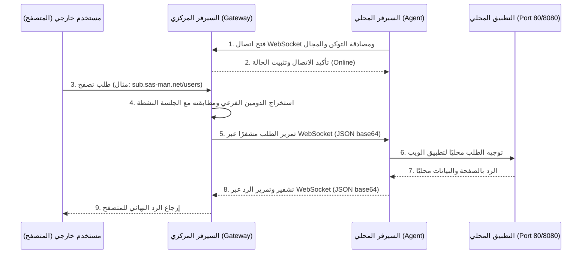
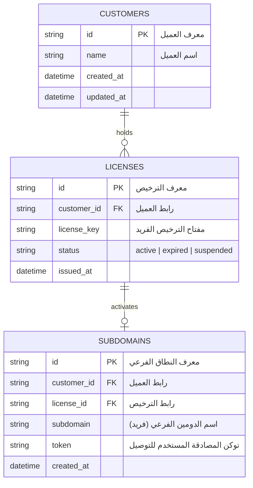

# دليل إدارة النطاقات الفرعية (Subdomains) والتوصيل بالنظام المركزي لـ SASMAN

يركز هذا الدليل على شرح تفصيلي لآلية التوصيل النفقي (Tunneling)، وتوليد النطاقات الفرعية (Subdomains)، وكيفية ربطها بالمستخدمين (العملاء والترخيص)، بالإضافة إلى كيفية ربط السيرفر المحلي (Agent) بالسيرفر المركزي (Gateway).

---

## 1. الهيكلية العامة لنظام التوصيل (System Architecture)

يعتمد نظام التوصيل في SASMAN على بروتوكول **WebSockets** لتمكين السيرفرات المحلية التي تعمل خلف جدران حماية (Firewall) أو شبكات متغيرة العناوين (NAT) من استقبال الطلبات العامة دون الحاجة لفتح منافذ (Port Forwarding) في الميكروتك أو المودم.



---

## 2. كيفية إنشاء النطاق الفرعي (Subdomain)

يتم إنتاج وإدارة النطاقات الفرعية على **السيرفر المركزي** عبر طريقتين:

### أ. يدويًا عن طريق واجهة الإدارة للسيرفر المركزي (`/admin`)
حيث يوفر السيرفر المركزي لوحة تحكم رسومية مبسطة تتيح لمدير النظام:
1. إدخال الدومين المطلوب (أو تركه فارغًا ليتم توليده تلقائيًا).
2. إدخال مفتاح المصادقة (Token) (أو تركه فارغًا ليتم توليده تلقائيًا).
3. الضغط على زر **Register**.

### ب. برمجياً عن طريق واجهات البرمجة (API)
يقوم النظام المركزي بتعريف المسار التالي لتسجيل الحاويات والعملاء الجدد:
- **المسار**: `POST /api/agents/register`
- **جسم الطلب (JSON)**:
  ```json
  {
    "subdomain": "customer-xyz",
    "token": "custom-secure-token"
  }
  ```
- **آلية التوليد التلقائي**:
  - إذا كان حقل `subdomain` فارغاً، يتم توليده بصيغة: `sasman-[timestamp]` (مثال: `sasman-178652399`).
  - إذا كان حقل `token` فارغاً، يتم توليده بصيغة مفتاح عشوائي: `tok-[16 random characters]`.

---

## 3. ربط النطاق الفرعي بمستخدمي النظام (Domain-to-User Mapping)

لربط كل مستخدم أو عميل بالنطاق الفرعي الخاص به بشكل دائم، يستخدم السيرفر المركزي قاعدة بيانات **SQLite** (الموجودة في السيرفر المركزي تحت المسار `data/sasman-central.db`). 

### هيكلية الجداول في قاعدة البيانات (Database Schema):


### آلية الربط عند التسجيل:
عند استدعاء خوارزمية تسجيل العميل على السيرفر المركزي:
1. يتم إنشاء حساب عميل في جدول `customers` (معرف فريد للعميل).
2. يتم إنشاء ترخيص نشط له في جدول `licenses` مرتبط بمعرفه.
3. يتم إدراج سجل جديد في جدول `subdomains` لربط العميل والترخيص بالدومين الفرعي المخصص والتوكن المطلوب للاتصال.

> [!IMPORTANT]
> تضمن قاعدة البيانات عدم تكرار الدومين الفرعي (`UNIQUE`) وتمنع أي سيرفر آخر من استخدام التوكن أو الدومين الخاص بعميل آخر بفضل التحقق الدائم من مطابقة التوكن مع اسم الدومين الفرعي أثناء خطوة تسجيل الـ WebSocket.

---

## 4. ربط السيرفر المحلي (Agent) بالنظام المركزي

لكي يربط السيرفر المحلي نفسه مع البوابة المركزية، يجب ضبط إعدادات التوصيل النفقي على النسخة المحلية إما عبر متغيرات البيئة أو واجهة التحكم الإدارية.

### الإعدادات المطلوبة (Environment Variables / Config):

| المتغير | القيمة المطلوبة | الشرح |
| :--- | :--- | :--- |
| `SASMAN_TUNNEL_MODE` | `agent` | تشغيل التطبيق في وضع الوكيل المتصل للبوابة المركزية |
| `SASMAN_SUBDOMAIN` | `customer-xyz` | اسم النطاق الفرعي الذي تم إنشاؤه لهذا العميل |
| `SASMAN_TUNNEL_TOKEN` | `tok-xyz123...` | التوكن الفريد المخصص للعميل لمصادقة اتصاله |
| `SASMAN_TUNNEL_GATEWAY_URL` | `ws://sas-man.net/ws` | عنوان الـ WebSocket الخاص بالسيرفر المركزي |
| `SASMAN_CENTRAL_DOMAIN` | `sas-man.net` | الدومين الرئيسي للسيرفر المركزي |

### طريقة الإعداد من خلال واجهة النظام المحلي:
1. اذهب إلى الإعدادات العامة للنظام المحلي.
2. اذهب إلى **إعدادات الـ Tunnel**.
3. قم بتغيير وضع التوصيل إلى **Agent**.
4. أدخل الدومين الفرعي المخصص لك، التوكن، وعنوان البوابة المركزية.
5. احفظ الإعدادات.

---

## 5. تفاصيل فنية لآلية معالجة الطلبات وإعادة التوجيه

عندما يقوم العميل بتشغيل السيرفر المحلي ويكون في وضع `agent`:
1. **إنشاء الاتصال**:
   يفتح العميل اتصال WebSocket مباشر باتجاه السيرفر المركزي:
   `ws://sas-man.net/ws`
2. **التسجيل والمصادقة**:
   يرسل العميل رسالة تسجيل تحتوي على:
   ```json
   {
     "type": "register",
     "payload": {
       "subdomain": "customer-xyz",
       "token": "tok-xyz123..."
     }
   }
   ```
   يقوم السيرفر المركزي بفحص التوكن والدومين من قاعدة البيانات، وفي حال التطابق، يربط قناة اتصال الـ WebSocket الحالية بهذا النطاق الفرعي ويغير حالته إلى `connected: true`.
3. **توجيه حركة المرور**:
   عندما يطلب زائر المسار `http://customer-xyz.sas-man.net/dashboard`:
   - يلتقط السيرفر المركزي هذا الطلب، ويقوم بتحويل محتويات الطلب (العنوان، الرؤوس Headers، محتوى الطلب المرمز بـ Base64) إلى كائن JSON ويرسله عبر قناة الـ WebSocket المرتبطة بالعميل.
   - يستقبل السيرفر المحلي كائن JSON، ويفك تشفيره، ثم يقوم بعمل طلب محلي (Local HTTP Request) إلى تطبيق SASMAN المحلي (على المنفذ الافتراضي `http://127.0.0.1:8080`).
   - يأخذ السيرفر المحلي الرد الناتج، ويحوله إلى كائن JSON ويرسله كـ `http_response` عبر الـ WebSocket للسيرفر المركزي.
   - يقوم السيرفر المركزي بتسليم الرد النهائي للمستخدم الخارجي.

> [!TIP]
> يتيح هذا التصميم سرعة تصفح فائقة وأماناً عالياً لأن حركة المرور بين الوكيل والمخدم المركزي مشفرة بالكامل، ولا تطلب وجود عنوان IP عام (Public IP) لدى العميل.
