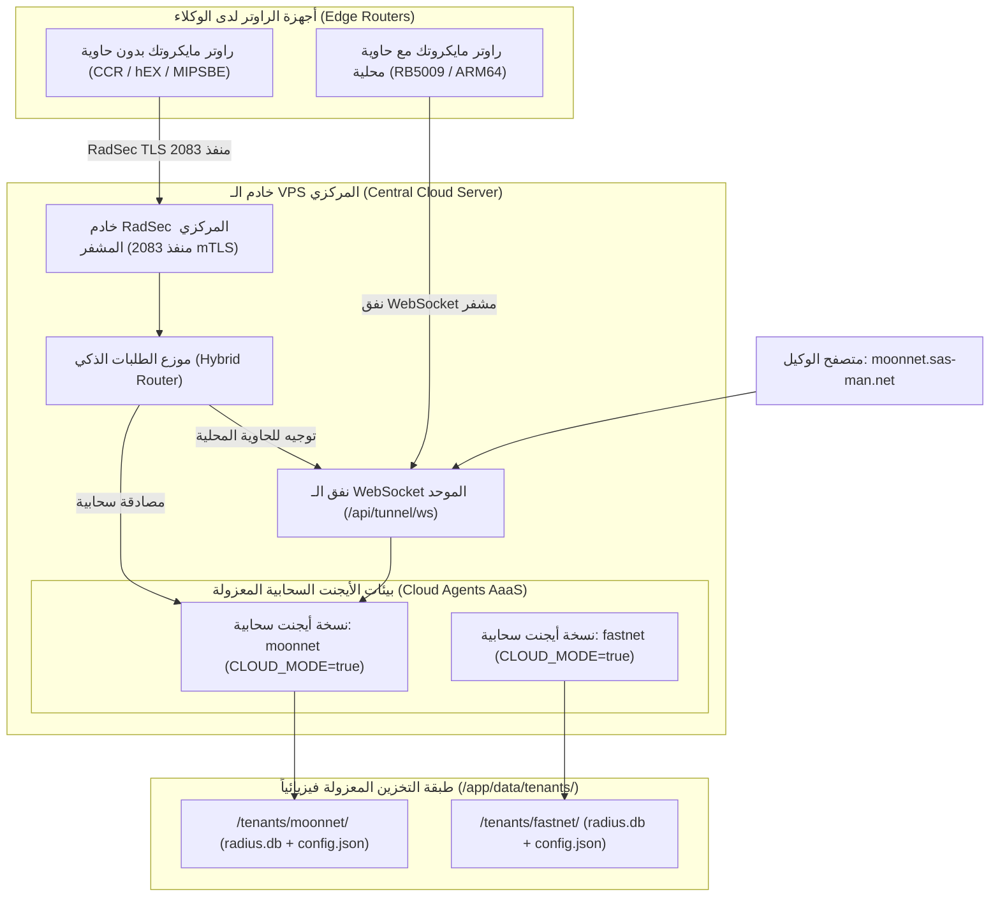

# 🌐 دليل نظام ساسمان السحابي الشامل (SASMAN Cloud Edition Guide)

---

## 📑 1. المقدمة والهدف المعماري (Overview & Purpose)

تم تصميم وتطوير **نظام SASMAN السحابي (Cloud Edition)** لحل إحدى أكبر العقبات التي تواجه أصحاب الشبكات والأبراج، وهي:
> **وجود راوترات مايكروتك لا تدعم تشغيل الحاويات (Containers)**، مثل المعالجات القديمة أو الاقتصادية:
> * عائلة **MIPSBE** (مثل: RB750Gr3, RB951Ui, hEX, BaseBox).
> * عائلة **TILE** (مثل: سحابة راوترات CCR1009, CCR1016, CCR1036, CCR1072).
> * أجهزة **SMIPS / MMIPS** أو أي راوتر بمساحة تخزين فلاش صغيرة لا تسع الحاويات.

### الحل السحابي الذكي:
بدلاً من حرمان أصحاب هذه الراوترات من مميزات نظام SASMAN المتطور:
1. يحصل الوكيل على **نسخة أيجنت كاملة طبق الأصل (Agent-as-a-Service)** تعمل له في السحابة على الـ VPS.
2. يدخل على لوحة تحكمه عبر نطاقه الفرعي المخصص (مثل `http://moonnet.sas-man.net/radius`).
3. ينسخ كود الربط السحابي ويلصقه في المايكروتك بضغطة زر واحدة.
4. يتصل الراوتر مباشرة بالسيرفر السحابي عبر بروتوكول **RadSec المشفر (RFC 6614 على منفذ 2083)**، وتتم المصادقة والمحاسبة فوراً سحابياً بدون حاجة لأي حاوية في الراوتر!

---

## 🏛️ 2. مخطط المعمارية السحابية (Architecture Flow)



---

## 🗄️ 3. عزل البيانات الفيزيائي الفائق (Data Isolation)

حرصاً على سرية وأمان بيانات كل وكيل، لا يتم خلط بيانات المشتركين أو السجلات في قاعدة بيانات مشتركة، بل يمتلك كل وكيل مجلداً مستقلاً تماماً:

```text
/app/data/tenants/{subdomain}/
│
├── radius.db               # قاعدة بيانات SQLite معزولة (المشتركون، الكروت، الباقات، الجلسات)
├── config.json             # ملف الضبط والجلسة المعزول الخاص بالوكيل
├── routing_data.json       # مجموعات التطبيقات والألعاب والـ IP Groups
├── cloud_license.json      # رخصة الوكيل السحابي المربوطة بنطاقه
└── certs/                  # شهادات التشفير الرقمية mTLS الخاصة براوتراته
    ├── ca.crt              # شهادة الجذر للسيرفر
    ├── agent.crt           # شهادة الراوتر الرقمية (CN=agent-{subdomain}-SASMAN)
    └── agent.key           # المفتاح الخاص للراوتر
```

### مميزات هذا العزل:
1. **انعدام احتمال تداخل البيانات**: يستحيل لوكيل رؤية بيانات أو كروت أو مشتركي وكيل آخر.
2. **سهولة النسخ الاحتياطي والنقل**: يمكن سحب نسخة احتياطية لشبكة الوكيل عبر نسخ مجلده فقط (`/app/data/tenants/{subdomain}`).
3. **أداء فائق السرعة**: كل قاعدة بيانات تعمل بنمط `WAL (Write-Ahead Logging)` المستقل دون أن تؤثر عمليات وكيل على استعلامات وكيل آخر.

---

## 🖥️ 4. تجربة الوكيل ونظام الأيجنت الكامل (Full Agent Experience)

يحصل الوكيل السحابي على **نفس نظام ولوحة تحكم الأيجنت الأصلية بالكامل 100%** التي تعمل داخل الحاويات، وتشمل:

| القسم | الوصف والمميزات المتاحة للوكيل السحابي |
| :--- | :--- |
| **إدارة المشتركين (Users)** | إضافة وتعديل وحذف المستخدمين، اشتراكات البرودباند والاشتراكات الشهرية، تحديد السرعات، وتواريخ الانتهاء. |
| **الكروت والقسائم (Vouchers)** | توليد كروت الهوتسبوت بعدد يصل إلى آلاف الكروت دفعة واحدة، طباعة القسائم، وتصدير الـ PDF وقوالب الكروت. |
| **باقات السرعة (Profiles)** | تحديد السرعات (Upload/Download)، المدد الزمنية، الأسعار، ومحددات المايكروتك (`Mikrotik-Rate-Limit`). |
| **إشعارات الواتساب والتلغرام** | ربط رقم واتساب للشبكة لإرسال تنبيهات قرب انتهاء الاشتراك ورسائل التجديد التلقائية للمشتركين. |
| **مصمم الهوتسبوت (Hotspot Templates)** | مصمم صفحات تسجيل دخول الهوتسبوت الاحترافي المتوفر في نظام SASMAN الأصلي. |
| **سجلات الجلسات الحية (Sessions)** | مراقبة المشتركين المتصلين بالراوتر لحظياً، استهلاك الجيجابايت، وفصل أي مشترك بنقرة زر. |
| **النسخ الاحتياطي وسجلات التدقيق** | تصدير واستيراد قواعد البيانات وسجلات العمليات المالية والمشرفين. |

---

## ⚡ 5. ربط راوتر المايكروتك بنقرة زر واحدة (1-Click MikroTik Setup)

عند إنشاء الحساب، يحصل الوكيل على كود ربط فوري خاص بنطاقه ينسخه ويلصقه في **Terminal** المايكروتك:

```routeros
/tool fetch url="https://sas-man.net/pki/install/moonnet.rsc" dst-path="sasman_cloud.rsc" mode=https; :delay 2s; /import sasman_cloud.rsc;
```

### ماذا يفعل هذا السكربت داخل الراوتر تلقائياً؟
1. **تحميل الشهادات المشفرة**: ينزل `ca.crt`, `sasman-agent.crt`, `sasman-agent.key` الخاصة بنطاق الوكيل.
2. **استيراد الشهادات بأمان**: استيراد الشهادات في مخزن شهادات المايكروتك (`/certificate`).
3. **تفعيل RadSec المشفر**:
   ```routeros
   /radius add address=sas-man.net protocol=radsec authentication-port=2083 accounting-port=2083 \
       service=hotspot,ppp,login,wireless \
       certificate="agent-moonnet-SASMAN" \
       secret="radsec" \
       timeout=3000ms \
       comment="SASMAN_CLOUD"
   ```
4. **تفعيل المحاسبة اللحظية**:
   ```routeros
   /radius incoming set accept=yes port=3799
   /ppp aaa set use-radius=yes interim-update=2m
   /ip hotspot profile set [find] use-radius=yes radius-interim-update=2m
   ```
وفور تنفيذ هذا السطر، يصبح الراوتر متصلاً بالسيرفر السحابي، ويبدأ بمصادقة المشتركين واحتساب رصيدهم فورياً!

---

## 🔍 6. كيف يميز النظام بين الحاوية السحابية والحاوية المحلية؟ (`CLOUD_MODE`)

يعتمد النظام على منطق بيئي ذكي يضمن **صفر تأثير على الراوترات المحلية**:

```go
// فحص وضع التشغيل داخل كود الأيجنت:
if os.Getenv("CLOUD_MODE") == "true" || os.Getenv("SASMAN_CLOUD_MODE") == "true" {
    // 1. نحن في السحابة (Cloud Mode):
    // - الترخيص مفعل تلقائياً ومرتبط بالدومين الفرعي
    // - إلغاء شاشة طلب إدخال IP ومعلومات المايكروتك المحلي
    // - الاتصال تلقائياً بنفق السيرفر المركزي الداخلي
} else {
    // 2. نحن داخل راوتر مايكروتك حقيقي (Local Router Mode):
    // - طلب الاتصال بالمايكروتك المحلي (127.0.0.1)
    // - فحص سيرال العتاد الحقيقي والترخيص المحلي
}
```

### جدول مقارنة بيئات التشغيل:

| الخاصية | راوتر مايكروتك مع حاوية (محلي) | راوتر مايكروتك بدون حاوية (سحابي) |
| :--- | :--- | :--- |
| **مكان تشغيل الأيجنت** | داخل الراوتر نفسه (حاوية RouterOS) | على سيرفر الـ VPS السحابي (Cloud Instance) |
| **بروتوكول اتصال الراوتر** | راديوس محلي UDP (`127.0.0.1:1812`) | راديوس مشفر RadSec TLS (`sas-man.net:2083`) |
| **طلب بيانات دخول الراوتر** | يطلب IP واسم المستخدم للـ API المحلي | **لا يطلبها**، الربط يتم بالشهادات المشفرة |
| **نوع أجهزة المايكروتك المدعومة** | فقط الراوترات التي تدعم الحاويات (ARM/x86) | **جميع أجهزة المايكروتك بلا استثناء** (100% الدعم) |

---

## 🛠️ 7. دليل التشغيل والصيانة للمشرف (Ops & Maintenance)

### مسارات النظام على سيرفر الـ VPS:
* **مجلد بيانات المستأجرين**: `/root/sasman-central/server/data/tenants/` (أو `/app/data/tenants/`).
* **شهادات الـ PKI**: `/app/data/pki/`.
* **قاعدة بيانات السيرفر المركزي**: `/app/data/sasman-central.db`.

### أوامر مفيدة للمشرف:

1. **عرض الوكلاء السحابيين النشطين**:
   ```bash
   ls -la /root/sasman-central/server/data/tenants/
   ```

2. **التحقق من سجلات السيرفر المركزي وخادم RadSec**:
   ```bash
   docker logs sasman-central --tail 50 -f
   ```

3. **إعادة تشغيل وكيل سحابي محدد يدparamوياً (إن لزم)**:
   ```bash
   docker restart sasman-cloud-moonnet
   ```

---

## 🎯 الخلاصة
نظام **SASMAN Cloud Edition** يوفر الآن منصة متكاملة ومزدوجة:
* أصحاب الراوترات الحديثة يواصلون استخدام حاوياتهم المحلية بأعلى كفاءة.
* أصحاب الراوترات الاقتصادية أو الكبيرة التي لا تدعم الحاويات يمتلكون الآن نفس النظام والقوة عبر السحابة بضغطة زر واحدة! 🚀
