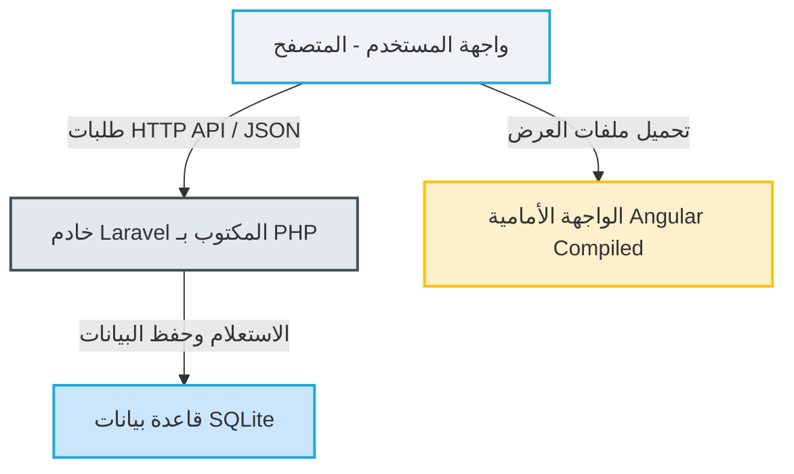

# تقرير التحليل الفني والتوثيق الهيكلي للوحة تحكم مشروع SAS RADIUS v4
> [!NOTE]
> تم إعداد هذا التقرير الفني ليوضح بالتفصيل الهيكل البرمجي وأنظمة التصميم والربط البرمجي المستخدمة في مشروع **SAS4** الحالي، ليمكّنك من بناء مشروعك الجديد بنفس الواجهة والتناسق البصري والهيكلي.

---

## 1. بنية وهيكلية النظام الحالي للمشروع (SAS4 Architecture)

يتبع مشروع **SAS4** الحالي هيكلية معمارية قوية تفصل بين واجهة المستخدم الرسومية والمنطق البرمجي الخلفي (Decoupled Client-Server Architecture):



### أ. الواجهة الأمامية (Frontend)
تعتمد لوحة التحكم بالكامل على إطار عمل **Angular SPA (Single Page Application)**، وتتميز بما يلي:
* **حزمة الإنتاج المجمعة (Compiled Assets):** تتواجد ملفات الواجهة داخل المسار `site/admin/frontend/`. وتتضمن حزم جافا سكريبت مجمعة ومضغوطة (`runtime.js`, `polyfills.js`, `vendor.js`, `main.js`) لتحقيق أداء عالي وسرعة فائقة في التصفح.
* **نظام التنسيق والتصميم (CSS System):** مبني على قالب الإدارة الشهير **CoreUI Admin Template** المتوافق مع **Bootstrap 4** (مع تعيين المتغير `window.__theme = 'bs4'`).
* **خطوط النظام:** تعتمد الواجهة على خطوط **Open Sans** بشكل رئيسي للغة الإنجليزية وتدعم الـ RTL للغة العربية والكردية عبر ملف إضافي مخصص `rtl.css`.

### ب. المنطق الخلفي (Backend)
تتم إدارة خادم الويب ومعالجة العمليات الحسابية والصلاحيات والربط مع سيرفرات الـ RADIUS من خلال إطار عمل **Laravel** المكتوب بلغة **PHP**:
* **موقع الكود:** يتواجد في المجلد `site/admin/backend/`.
* **الحماية والتشفير:** تم تشفير الكود البرمجي ونقاط الـ API في ملف `routes/api.php` بالكامل باستخدام **ionCube Loader** لضمان حماية حقوق البرمجية وحمايتها من التعديل غير المصرح به.
* **قاعدة البيانات (Database):** يستخدم النظام محرك قاعدة بيانات **SQLite** الخفيف والموجود في الملف `database.sqlite`.

---

## 2. نظام الألوان ومتغيرات البصرية (Design Tokens)

تعتمد الهيكلية البصرية الحالية على باليت ألوان وتنسيقات موحدة تم تثبيتها في جذر الصفحة (`:root`):

| اسم المتغير | اللون الافتراضي | كود الـ HEX | الاستخدام الوظيفي |
| :--- | :--- | :--- | :--- |
| `--primary` | أزرق سماوي | `#20a8d8` | الأزرار الرئيسية، الروابط النشطة، تمييز القوائم |
| `--success` | أخضر | `#4dbd74` | إشارات الاتصال، العمليات المالية الناجحة، الإيرادات |
| `--warning` | أصفر ذهبي | `#ffc107` | العمليات المعلقة، التنبيهات، إحصائيات معينة |
| `--danger` | أحمر | `#f86c6b` | المشتركون المنتهون، العمليات الملغية، تحذيرات المعالج |
| `--light-gray` | رمادي فاتح | `#eff3f8` | خلفية لوحة الإدارة والجسم الأساسي للصفحات |
| `--dark-gray` | رمادي داكن (سلات) | `#3e515b` | خلفية شريط التنقل الجانبي (Sidebar) وحروف العناوين |

---

## 3. الهيكلية البرمجية لنماذج البيانات (Database Models Mapping)

من خلال فحص نماذج Laravel Eloquent في مجلد الـ `app` للمشروع، تم استنباط الهيكل الوظيفي الكامل للوحة التحكم. يتكون مشروعك الجديد من نفس هذه المكونات الهيكلية:

1. **إدارة المشتركين (Users):**
   * `User`: يمثل العضو / Subscriber الأساسي.
   * `UserSession` & `Radacct`: لمراقبة جلسات الاتصال الحالية وتفاصيل الاستهلاك والوقت الفعلي.
   * `UserInvoice` & `UserReceipt`: لحساب فواتير وإيصالات المشتركين المالية.
   * `UserMac`: لربط حسابات المشتركين بالماك أدرس (MAC Address).
2. **إدارة الوكلاء والموزعين (Managers):**
   * `Manager`: نظام إدارة الحسابات الهرمية للوكلاء وأرصدتهم وعمولاتهم.
   * `ManagerJournal` & `ManagerInvoice`: لمراقبة ديون وقروض وسجلات شحن الموزعين.
3. **محرك الاشتراكات والباقات (Profiles & Pricing):**
   * `Profile` & `ProfilePricing`: تحديد سرعات التنزيل والرفع والأسعار المخصصة لكل وكيل.
4. **توليد الكروت والبطاقات (Cards System):**
   * `Card`: إدارة كروت شحن الرصيد والإنترنت.
   * `CardDesign`: تخصيص شكل وتصميم كروت الشحن المطبوعة للموزعين.
5. **الربط مع السيرفرات (NAS & Routers):**
   * `NAS`: إدارة اتصالات سيرفر RADIUS مع روترات الميكروتك (Mikrotik).
   * `IPPoolList`: إدارة مدى عناوين الـ IP الموزعة للمستخدمين.

---

## 4. شرح وتوثيق الواجهات الجديدة المُنشأة

> [!IMPORTANT]
> تم بناء وتصميم واجهتين كاملتين بجودة برمجية فائقة وبشكل مدمج (Self-Contained) يعتمد على لغات الويب الأساسية (HTML5, CSS3, JS) لتسهيل استخدامهما ودمجهما في أي مشروع جديد دون تعقيدات Angular أو React المجمعة.

تجد الملفات البرمجية جاهزة للعمل والاستخدام المباشر في مشروعك بالمسارات التالية:
1. **واجهة تسجيل الدخول للإدارة:** [login.html](file:///d:/SAS4%20DOK/sas4_recovered/sas4/sas4_custom_templates/login.html)
2. **واجهة لوحة الإدارة الرئيسية:** [dashboard.html](file:///d:/SAS4%20DOK/sas4_recovered/sas4/sas4_custom_templates/dashboard.html)

### أ. واجهة تسجيل الدخول (login.html)
* **المميزات البصرية:** تصميم زجاجي عصري (Glassmorphic) مع خلفية ذات تدرج لوني انسيابي ناعم يتناسب مع درجات اللون الأزرق المعتمدة لـ SAS4.
* **التجاوبية الكاملة:** متوافقة 100% مع الهواتف الذكية والأجهزة اللوحية والشاشات العريضة.
* **منطق التفاعل (UX):** 
  * ميزة إظهار وإخفاء كلمة المرور بالنقر على أيقونة العين.
  * نظام تحقق سريع وتنبيه ذكي باللون الأحمر مع حركة اهتزاز بصرية (Horizontal Shake Animation) عند إدخال بيانات خاطئة.

### ب. لوحة التحكم الرئيسية (dashboard.html)
* **الشريط الجانبي (Collapsible Sidebar):** يحتوي على الهيكل الدقيق لمشروع SAS4 (المشتركين، الوكلاء، الاشتراكات، المالية وكروت الشحن، السيرفرات والـ NAS، الإشعارات، والنسخ الاحتياطي).
* **إمكانية الطي والتصغير (Responsive Toggle):** يدعم الشريط الجانبي إمكانية الطي التلقائي ليتحول إلى شريط أيقونات صغير، مما يوفر مساحة عمل هائلة في الشاشات المختلفة.
* **بطاقات الإحصائيات (Metrics Widgets):** 4 كروت إحصائيات تفاعلية (المستخدمين النشطين، الأرباح، الوكلاء، حالة السيرفر) بتدرجات وأيقونات فاخرة.
* **رسم بياني فوري للشبكة (Network Traffic Sparkline):** رسم بياني ديناميكي مبني بتقنية SVG التفاعلية يحاكي معدل نقل البيانات اللحظي بالشبكة.
* **جدول الفواتير والعمليات المالية:** جدول متطور لعرض أحدث المشتركين مع بطاقات الحالة (تم الدفع باللون الأخضر، معلق باللون الأصفر، ملغي باللون الأحمر).
* **مراقبة أداء السيرفر اللحظي (Server Health Monitor):** شريط تقدم تفاعلي يحاكي استهلاك المعالج (CPU Load Load) والذاكرة العشوائية لراوتر الميكروتك والسيرفر بشكل حي وديناميكي كل 3 ثوانٍ باستخدام JavaScript.

---

## 5. دليل المطور للدمج والتطوير المستقبلي (Integration Guide)

> [!TIP]
> يمكنك ترحيل هذه الواجهات ودمجها بسهولة مع أي إطار عمل خلفي جديد تختاره لتشغيل مشروعك. إليك الخطوات المقترحة:

### أ. الدمج مع إطار عمل Laravel (PHP)
1. قم بنسخ الأكواد البرمجية من الملفين وضعها في مجلد العروض داخل Laravel:
   * انسخ `login.html` إلى `resources/views/auth/login.blade.php`.
   * انسخ `dashboard.html` إلى `resources/views/admin/dashboard.blade.php`.
2. استبدل البيانات الثابتة في الجداول والبطاقات بمتغيرات بليد (Blade variables)، مثل:
   ```html
   <!-- استبدال القيمة الثابتة للمتصلين حالياً بقيمة ديناميكية -->
   <div class="widget-value">{{ $activeUsersCount }}</div>
   ```
3. قم بعمل حلقة تكرار (`@foreach`) لقراءة أحدث العمليات المالية من قاعدة البيانات وعرضها في الجدول المخصص.

### ب. تغيير الألوان وتخصيص المظهر (Theming)
إذا رغبت في تغيير الهوية البصرية كاملة لمشروعك الجديد (مثلاً تحويل اللون من الأزرق إلى البنفسجي أو البرتقالي)، فلن تحتاج لتعديل مئات الأسطر البرمجية! ما عليك سوى تغيير كود اللون في متغيرات `:root` بأعلى ملفات الـ HTML وسوف تنعكس التغييرات تلقائياً على كامل عناصر الواجهة:
```css
:root {
    /* قم بتغيير هذا الكود فقط لتحديث الهوية البصرية للوحة التحكم بالكامل */
    --primary: #6f42c1; /* سيتحول النظام بالكامل إلى اللون البنفسجي الراقي */
    --primary-hover: #59339e;
}
```

---
*تم إعداد هذا التقرير وملفات العرض الفنية المرفقة لمساعدتكم في الانطلاق بمشروعكم الجديد بأعلى معايير الجودة البصرية والبرمجية.*
